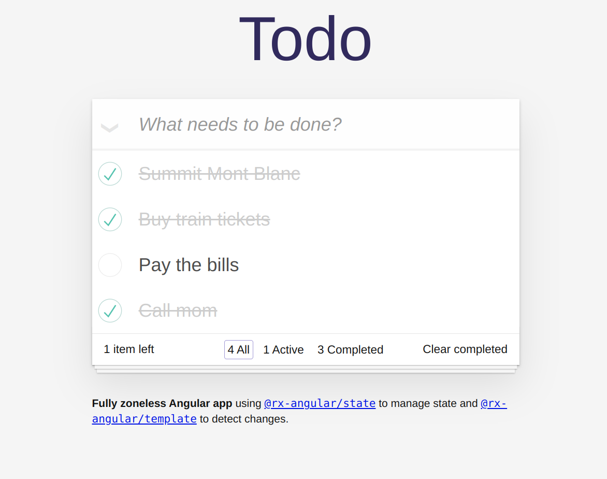

# RxAngular Todo MVC

Todo MVC demo using [RxAngular](https://rx-angular.github.io/rx-angular/#/).

- Push-based Architecture
- Standalone Components
- Fully Zoneless for lightning-fast performance
- Angular v17 with Control-Flow Syntax
- Consumes an API via HTTP (to showcase a real-world app)

